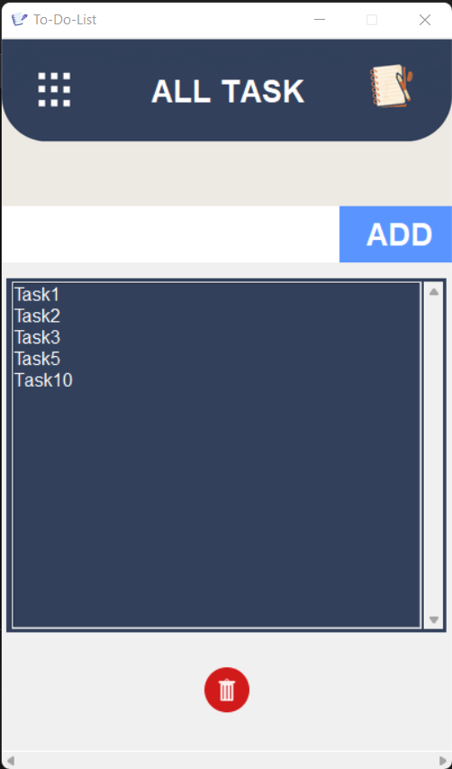
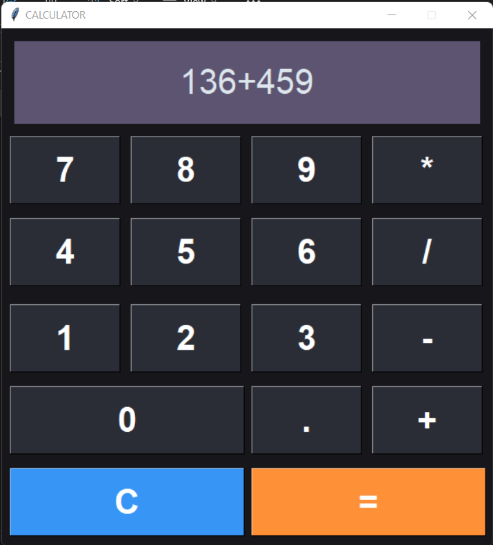
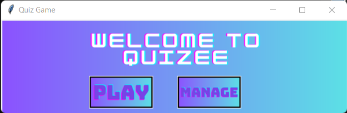

# Mini Python Projects
 

Created 3 mini python projrcts, **TO-DO LIST**, **CALCULATOR**, **QUIZ GAME**.
  

## TO-DO LIST
 

Created To-Do List application that helps users manage and organize their tasks efficiently. This is GUI-based application using Python, allowing users to create, update, and track their to-do lists.
  

  

## CALCULATOR
 

Designed a simple Calculator with basic arithmetic operations. Prompt the user to input two numbers and an operation choice. Perform the calculation and display the result.
  

  

##  QUIZ GAME
 

Developed a Quiz Game that asks users multiple-choice questions on a specific topic. The game could keep track of scores, provide feedback on correct/incorrect answers, and offer a variety of questions to make it challenging and engaging.
  

  

## Features
 

  - Load Quiz Questions
  - Add Questions
  - Remove Questions
  - Display Welcome Message and Rules
  - Present Quiz Questions
  - Evaluate the User's Answer
  - Provide Feedback
  - Calculate the Final Score
  - Display Final Results
  
